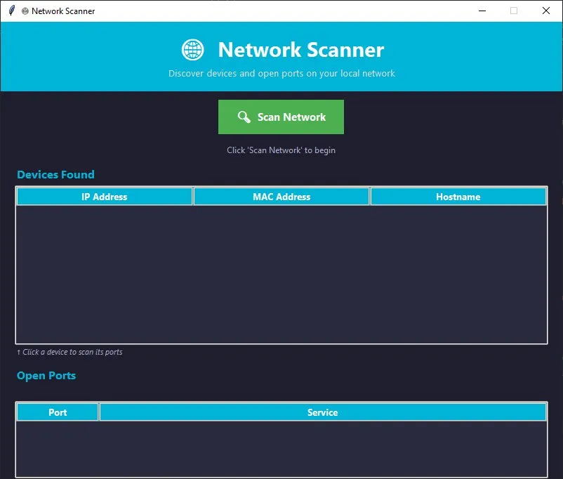

# 🌐 Network Scanner

A desktop application for discovering devices and scanning open ports on your local network, built with Python.



---

## Features

- **Device Discovery** — Scans your local network and finds all connected devices
- **Device Details** — Displays IP address, MAC address, and hostname for each device
- **Your Device Highlighted** — Your machine is highlighted in yellow for easy identification
- **Port Scanner** — Click any device to scan its common open ports
- **Service Detection** — Identifies the service running on each open port
- **Threaded Scanning** — UI stays responsive while scanning runs in the background
- **Clean Dark UI** — Built with Tkinter and a modern dark theme

---

## Tech Stack

- **Python 3.10**
- **Scapy** — ARP-based network device discovery
- **Tkinter** — GUI framework
- **Socket** — Port scanning and hostname resolution
- **Threading** — Non-blocking background scans

---

## Ports Scanned

The app checks the following common ports:

| Port | Service |
|------|---------|
| 21 | FTP |
| 22 | SSH |
| 23 | Telnet |
| 25 | SMTP |
| 53 | DNS |
| 80 | HTTP |
| 110 | POP3 |
| 135 | RPC |
| 139 | NetBIOS |
| 143 | IMAP |
| 443 | HTTPS |
| 445 | SMB |
| 3389 | RDP |
| 8080 | HTTP Alt |
| 8443 | HTTPS Alt |

---

## Getting Started

### Prerequisites

- Python 3.10 or higher
- [Npcap](https://npcap.com/#download) installed (required for Windows packet capture)
- Administrator privileges

### Installation

1. Clone the repository:
   ```bash
   git clone https://github.com/MaxsCaretaker/network-scanner.git
   cd network-scanner
   ```

2. Install dependencies:
   ```bash
   pip install scapy psutil
   ```

3. Install Npcap:
   - Download from [npcap.com](https://npcap.com/#download)
   - Run the installer with **"WinPcap API-compatible mode"** checked

4. Run the app as Administrator:
   ```bash
   python app.py
   ```

---

## Usage

1. Launch the app with Administrator privileges
2. Click **Scan Network** to discover all devices on your local network
3. View IP address, MAC address, and hostname for each device
4. Click any device in the list to scan its open ports
5. View open ports and their associated services in the bottom panel

---

## ⚠️ Disclaimer

This tool is intended for use on your own network only. Scanning networks without authorization is illegal. Use responsibly.

---

## Project Structure

```
network-scanner/
├── app.py          # Main application
├── test_scan.py    # Network scan test script
└── README.md
```

---

## Author

**Sergio Nunez** — Computer Engineering, B.S.  
[GitHub](https://github.com/MaxsCaretaker) | [LinkedIn](https://linkedin.com/in/sergio-nunez)

---

## License

This project is open source and available under the [MIT License](LICENSE).
